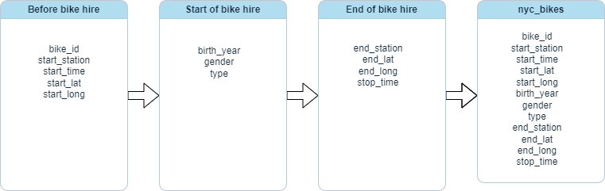

## 1. Documentation

**Domain knowledge (1.1)**

Citi Bike is the bike share program with 25,000 bikes and over 1,500 stations across Manhattan, Brooklyn, Queens, the Bronx, Jersey City, and Hoboken. It was launched in May 2013 and has become a very important part of transportation network in New York. It offers a variety of bike hire plans which range from single use to annual memberships with an access to bikes and scooters all over the USA. 
The bikes can be unlocked from one city station and returned into the other. People tend to use the bike share system for a variety of reasons - commuting to the place of work or school or to run errands to name just few.
As City Bike offers a 24 hours a day, 7 days per week and 365 days a year access it offers an excellent flexibility to its users. Since its launch in 2013 it has grown in popularity and in July 2020 Citi Bike riders took their 100 Millionth trip.

**Data quality and data bias (1.6)**

The data used in this report has been provided by Citi Bike NYC. It is a sample  of the usage of 10 bikes across 2018. Each bike has a unique identifier and the data provided includes details corresponding with each trip( e.g. trips start and end location and time) together with customers year or birth, gender and bike usage type. 

The data has been anonymised, which removes the risks of breaching data privacy for any of the service users. 
There is no information about how the data has been chosen for the sample, therefore it is hard to assess whether the sample selection process has not introduced any intentional or unintentional bias. The sample is also relatively small as it is limited to the usage of 10 bikes only and this poses a risk of the sample not being representative of the whole population. This in turn leads to the another challenge - related to statistical reliability.

There may be a need to run further analysis on a bigger sample to confirm the initial findings from this report.


Please describe what steps you plan to take to complete this report.

**Business requirements (1.2)**

In the report I am hoping to find the answer to the following questions:

- What is the pattern of bike hires over time?

- Do bike hire patterns differ between bike rider demographics? (e.g. gender, type of user, age)


**Business processes and data flow (1.3)**
 
 


**Data types (1.5)**

The Bike data is a tsibble including 12 columns and 4268 rows. The tsibble includes the following data types:

* interval - e.g. time series data (which is a collection of data points recorded in chronological order),

* categorical data e.g. type (Subscriber, Customer) or gender (Male, Female)

* nominal e.g. bike id or start_station and end_station id's (which labels data without providing any quantitative value) 

* spatial data e.g. start and end longitude and latitude


## 2. Data cleaning

**Preparing data for visualisation (1.7)**

In order to do data cleaning and preparing data for visualistations I have used a tidyverse package together with the following libraries:tsibbledata, tsibble, sf and leaflet. 
To start with, I divided start time into 4 columns : *year, month, day and weekday.* Then I added a *date*, a *hire_length*  and *age* columns. As the *age* column included ages over 123(the highest age recorded so far in history), so I changed them to NAs and dropped them as there were only 2.
I have also divided *starting_time* to *hour*, *minute* and *second* columns, created an  *age_range* and a *season* columns.
Finally, I assigned the colour palette to an object called *colour_scheme*, so all visualisations could be uniform.

```{r setup, include=FALSE}
knitr::opts_chunk$set(
  message = FALSE,     # Hide messages
  warning = FALSE      # Hide warnings
)

library(tidyverse)
library(tsibbledata)
library(tsibble)
library(dplyr)
library(ggplot2)
library(sf)
library(lubridate)
library(leaflet)

nyc_bikes_df <- nyc_bikes

# Dividing start time into 4 columns: *year, month, day and weekday.* 


nyc_bikes_df <- nyc_bikes_df %>% 
  mutate(year = year(start_time),
        month = month(start_time, label = TRUE, abbr = TRUE),
        day = day(start_time),
        weekday = wday(start_time, label = TRUE, abbr = TRUE)
                        )

# Add a *date* column.

nyc_bikes_df <- nyc_bikes_df %>% mutate(date = as_date(ymd_hms(start_time)))

# Add *hire_length* column.


nyc_bikes_df <- nyc_bikes_df %>% mutate(hire_length = as.period(stop_time - start_time))

# Add *age* column and change to NA those who's age is over 126 (the highest age recorded so far in history is 123) and then drop them as there were only 2.

nyc_bikes_df <- nyc_bikes_df %>% mutate(age = 2018 - birth_year) %>% mutate(age = if_else(age > 126, NA, age)) %>% drop_na(age)

# Divide *starting_time* to *hour*, *minute* and *second* columns.

nyc_bikes_df <- nyc_bikes_df %>% 
      mutate(hour = hour(hire_length),
             minute = minute(hire_length), 
             second = second(hire_length)) %>% 
      mutate(length_minutes = round(hour * 60 + minute + second/60))

# Create new column *age_range*.

nyc_bikes_df <- nyc_bikes_df %>% 
  mutate(age_range = case_when(
    age < 19 ~ "18 or less",
    age >= 19 & age < 30 ~ "19 to 29",
    age >= 30 & age < 40 ~ "30 to 39",
    age >= 40 & age < 50 ~ "40 to 49",
    age >= 50 & age < 60 ~ "50 to 59",
    age >= 60 ~ "60 or over"
         ))

# Create a column *season*.

nyc_bikes_df <- nyc_bikes_df %>% mutate(season = case_when(
  month %in% c("Dec", "Jan", "Feb") ~ "Winter",
  month %in% c("Mar", "Apr", "May") ~ "Spring",
  month %in% c("Jun", "Jul", "Aug") ~ "Summer",
  month %in% c("Sep", "Oct", "Nov") ~ "Autumn"
))


# Assign colour palette to an object called *colour_scheme*, so all visualisations are uniform.


colour_scheme <-  c("#E69F00", "#56B4E9", "#009E73", "#F0E442", "#0072B2", "#D55E00", "#CC79A7")
```


**Data visualisation as a tool for decision-making (1.4)**

*Process and design (2.1, 2.7, 2.8, 2.9)*

At first, I investigated variables of interest with simple single-variable distribution plots. Then I plotted variables, that I felt were important in order to answer questions set out for this report.

The Key performance Indicators (KPIs) in the analysis were the number of bike hires.

I was trying to see if there were any patterns present in the data. After selecting key visualisations I made sure these were clearly portraying the message I wanted to convey, were aesthetically pleasing, as well as accurate and not misleading. The visualisations in this report were made in RStudio using the ggplot and leaflet packages. The colour scheme used in the visualisations is colour blind friendly. 


## **1. Start stations across Jersey City.** 


```{r echo=FALSE}

nyc_bikes_tibble <- as_tibble(nyc_bikes_df)
start_stations <- nyc_bikes_tibble %>%
  select(start_station , start_lat, start_long) %>% 
  group_by(start_station) %>% 
  summarise(start_long = first(start_long), 
            start_lat = first(start_lat))

leaflet(start_stations) %>% 
    addTiles() %>% 
    addMarkers(
      lng = ~ start_long, 
      lat = ~ start_lat, 
      clusterOptions = markerClusterOptions(),
          icon = icons(iconUrl = "https://play-lh.googleusercontent.com/nU9hlehhCfKL3UVhtOVnKJIRU3967x2ivi5m4Ny5VDY2vcDTwK2_b_KLGpnx1C-alWU",iconWidth = 30, iconHeight = 30), label = ~start_station)
```

This is a geospatial visualisation showing 52 bike hire stations in Jersey City that have been starting stations for the 10 bikes included in the data set. It includes id labels for each station for easy identification should we need it and is interactive. This visualisation provides information of the geographic spread of bike stations, which could help in identifying gaps in the coverage of bike hire stations and help to choose more optimal locations for new ones.


## **2. What was the pattern of bike hires throughout 2018?**

```{r echo=FALSE}

nyc_bikes_df %>% 
  ggplot()+
  geom_bar(aes(x = month, fill = type))+
   theme(axis.text = element_text(size = 12))+
  scale_fill_manual(values = colour_scheme)+
  theme_minimal()+
  labs(
    
    title = "\nBike hires by month and type\n",
    x = "\nDay of the week\n", 
    y = "\nCount\n"
   
  )+
  theme(axis.text.x = element_text(angle = 45, hjust = 1))
```
The bar plot above shows the relationship between the number of bike hires per each month of the year categorised by user type. The x-axis represents the months of the year, while y axis represents the count of bike hires. The plot reveals a distinct pattern of increased bike hires during summer months, especially from May to August. This trend suggests that the increase in bike hires is likely to be linked with the changes in weather. In addition to that the plot differentiates between two user types: customer which is more of a casual user and subscriber which is more of a regular user. We can notice an increase in bike hires across both customer categories during warmer months of the year, however regular users are the key users across the entire year.
This visualisation suggests that there may be a need for increased allocation of resources during warmer months of the year to match the demand. It also highlights user preferences/behaviors when considering promoting strategies for the business e.g.marketing campaigns or seasonal pricing offers.

## **3. Bike hires during summer and winter months.**

```{r echo=FALSE}

nyc_bikes_df %>% filter(season == "Summer" | season == "Winter") %>% 
  ggplot(aes(x = weekday, fill = type))+
  geom_bar()+
  facet_grid(~ season)+
   theme(axis.text = element_text(size = 12))+
  scale_fill_manual(values = colour_scheme)+
  theme_minimal()+
  labs(
    
    title = "\nBike hires distribution across the week depending on the season\n",
    x = "\nDay of the week\n", 
    y = "\nCount\n")+
  theme(axis.text.x = element_text(angle = 45, hjust = 1))
```
The plot above shows the number of bike hires across different day of the week during summer and winter season, again categorised by a customer type. We can notice that subscribers are he they key customers regardless of the season, however their number is significantly higher across each day of the week during Summer.The plot shows that subscriber users tend to hire bikes more between Monday and Friday during Summer and Monday - Wednesday during Winter. Casual users depicted as customers on the plot are almost non existent during Winter, however they emerge during Summer with Saturday and Sunday being the most popular days for bike hiring which suggests a more leisurely use. The patterns emerging here suggest that there is an increased demand for bike hires on Tuesdays, Wednesdays and Fridays during Summer and Mondays, Tuesdays and Wednesdays during Winter. The demand for bike hires during wither months is much lower. 
The inforamtion revealed by this plot can help with resource planning and allocation, and also inform decision making related to planning marketing strategies.

## **4. A typical regular (subscriber) user.**

```{r echo=FALSE}

nyc_bikes_df %>% filter(gender == "Male" | gender == "Female") %>% filter(type == "Subscriber") %>% filter(season == "Summer" | season == "Winter") %>% 
  ggplot(aes(x = age_range, fill = gender))+
  geom_bar(position = "dodge")+
  facet_grid(~season)+
  theme(axis.text = element_text(size = 12))+
  scale_fill_manual(values = colour_scheme)+
  theme_minimal()+
  labs(
    
    title = "\nRegular user bike hires by season, age range and gender\n",
    x = "\nAge range\n", 
    y = "\nCount\n")+
  theme(axis.text.x = element_text(angle = 45, hjust = 1))

```

The plot above shows the distribution of customers by age range and gender across season (Winter and Summer). The x-axis represents age ranges of customers starting from 19 as it was the youngest age of a customer in a data set up until aged over 60. We can notice from the plot that males and females aged 30-39 are hiring bikes more often than other age groups however males within that age range are hiring bikes significantly more than females. In general males tend to be the main users of NYC Citi bikes regardless of age and time of the year. Females aged 50 or over are less likely to use bike hiring service across both seasons.

The information provided by this plot can help making decisions related to marketing strategies and resource allocations.

## **5. A typical casual (customer) user.**

```{r echo=FALSE}
nyc_bikes_df %>% filter(gender == "Male" | gender == "Female") %>% filter(type == "Customer") %>% filter(season == "Summer" | season == "Winter") %>% 
  ggplot(aes(x = age_range, fill = gender))+
  geom_bar(position = "dodge")+
  facet_grid(~season)+
  theme(axis.text = element_text(size = 12))+
  scale_fill_manual(values = colour_scheme)+
  theme_minimal()+
  labs(
    
    title = "\nCasual user bike hires by season, age range and gender\n",
    x = "\nAge\n", 
    y = "\nCount\n")+
  theme(axis.text.x = element_text(angle = 45, hjust = 1))
```

The plot above shows the distribution of customers by age range and gender across season (Winter and Summer). The x-axis represents age ranges of customers starting from 19 as it was the youngest age of a customer in a data set up until aged over 60. Thy y-axis represents the count of hires. With the help of the plot we can notice that females tend to not hire bikes during winter season across all age groups. Males over 40 are also not being represented in the sample. In addition the plot also reveals that  users aged 19 - 39 across both genders have dominated the casual bike hires during Summer however males tend to hire bikes more often than females. 

The visualisation provides an insight into the bike usage pattern among casual users which could inform potential marketing strategies.

## **Conclusions**

1. The bike stations across Jersey City seem to be spread more across the center, however we need to remember this are only the stations that have been a staring point for the 10 bikes.

2. There is a clear increase in the bike use during summer months compared to other seasons (winter especially), which suggest an increased demand for resource allocation due to demand.

3. Both casual and seasonal users contribute to the overall bike increase in bike hires during summer months, however the core hiring customers are the regular ones regardless of the month.

4. The age group of 30 - 39 tends to have the highest frequency of bike hires closely followed by 19-29 age group. It may be worth investigating if these groups share any other characteristics or behavioural patterns.

5. Females tend to be using bike hire service less often than males and this could also be investigated further to establish any underlying reasons that could potentially be addressed by new marketing strategies.

6. During the winter season, only males aged 19-39 utilized the bike hire service on casual basis, suggesting a specific target audience during colder months. This could be also investigated further.


