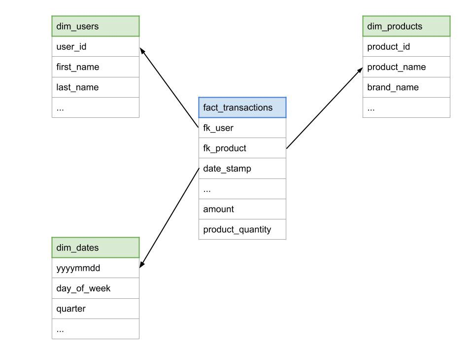

```{r, echo = F}
knitr::opts_chunk$set(warning = F, message = F)
```

For this task you will be working with some (synthetic) second-hand toy sales data, specifically cleaning and joining the data, as well as considering table relationships and data storage.

Please work through your answers in an .Rmd, and then knit to html/pdf for your submission.

## 1

Load in the transaction data and create a column `date` from the day, month and year columns.

## 2

Load in the toys data and:

  1. Convert the weight column to numeric. 
  2. Split the extra information from the product into a new column, so you have two columns: `product_name` and `product_title`. Make sure you don't have any extra whitespace in either column.


## 3

Load in the dataset on quality labels and:

  1. Remove the unnecessary information for each descriptor
  2. Replace the categories so 'Awesome' and 'Very Awesome' become 'Good' and 'Very Good'. Do the same thing for 'Awful' replacing it with 'Bad'.

## 4

With `fs::dir_ls()` you can first list all files which meet a certain regex pattern (`regexp` argument). So for example, any files that have a .csv extension. You can then pipe those file path names into `purrr::map_dfr()` to apply `read_csv()` to all of them and bind them all into one dataframe.

__[Here is a tutorial on how to do it](https://www.gerkelab.com/blog/2018/09/import-directory-csv-purrr-readr)__

Using the steps above, create a dataframe called `customers` which contains data on customers from all countries by reading in and binding all customer datasets **in one pipeline**.

## 5

Impute missing values in numeric columns with the median value of customers with the same gender and country. For example, a customer whose gender is female and whose country is Australia with a missing age should get the median age of all Australian females in the dataset.

**Hint**: You can combine a `group by()` with `mutate(across())` to apply `coalesce` across columns which meet a logical criteria specified with `where()`. **Also** remember, in `across()` we can define our own anonymous function like so `~ mean(.x, na.rm = TRUE)` where the `.x` represents what is being iterated on (when using across, this is the columns).

## 6

Create a star schema and save the image for uploading. The star schema should show the relationships between your four current datasets (transactions, toy details, customers, and quality). You can make it using https://excalidraw.com or https://app.diagrams.net or any other tool that you find useful. Below is an example star schema:

{width=50%}

## 7

Join your four cleaned datasets together and call the joined dataset `toys_joined`. This join should keep all observations from all tables.

## 8

Are there any ethical and legal considerations with storing this data in its current state?

**Write a short answer**

## 9

Remove any personally identifiable or [sensitive](https://ico.org.uk/for-organisations/guide-to-data-protection/guide-to-the-general-data-protection-regulation-gdpr/lawful-basis-for-processing/special-category-data/#scd1) information on customers.

## 10

Write your new joined dataset (which does not contain personal/sensitive information) to a csv file.

## 11

Use a .gitignore file to make sure the raw data on customers which still contains personal/sensitive information is not pushed up to your PDA GitHub.

# PDA Submission

Save your star schema as an image file, take a screenshot of your written answer to Question 8, and have your knitted .Rmd file for your submission!

# PDA Outcomes covered by this task

From Working with Data (J4Y6 35)

* 1.8 Data management including security
* 3.1 Tools for data transformation including tools for automating data transformation 
* 3.2 Types of data transformation
* 3.3 Transformations including joins
* 3.4 String manipulation including extracting a substring, replacing part of a string, joining strings and splitting strings
* 3.5 Data cleaning
* 3.6 Data modelling including star schema 
* 3.7 Data loading
* 3.8 Legal and ethical considerations for data storage