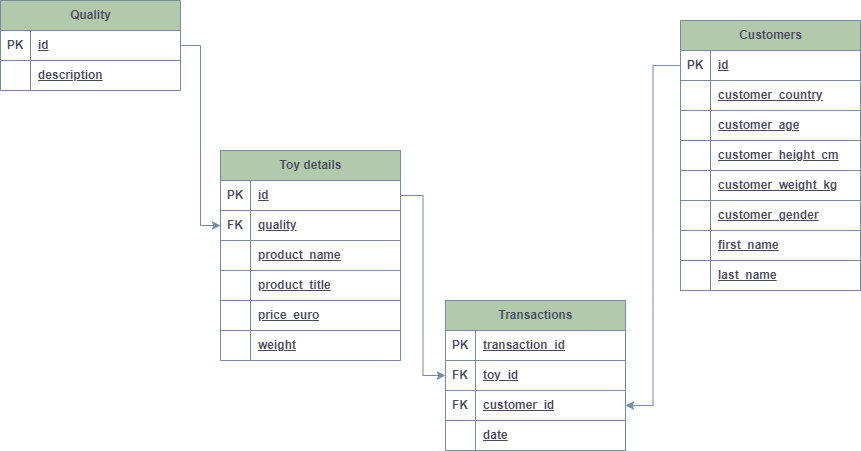
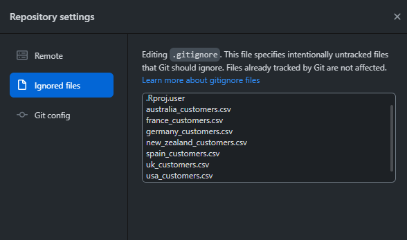

## 1

Load in the transaction data and create a column date from the day, month and year columns.

```{r setup = FALSE}

library(tidyverse)
knitr::opts_chunk$set(
  message = FALSE,     # Hide messages
  warning = FALSE      # Hide warnings
)

transactions <- read_csv("raw_data/toy_transactions.csv")
transactions <- transactions %>% 
  unite(date, day, month, year, sep = "/")
```
## 2

Load in the toys data and:

Convert the weight column to numeric.
Split the extra information from the product into a new column, so you have two columns: product_name and product_title. Make sure you don’t have any extra whitespace in either column.

```{r setup = FALSE}

knitr::opts_chunk$set(
  message = FALSE,     # Hide messages
  warning = FALSE)     # Hide warnings

  # read in toys csv
toys <- read_csv("raw_data/toys.csv")

# convert weight column into a numeric one
toys <- toys %>% mutate(weight = as.numeric(str_remove(weight, "[a-z]")))

# split info from product column into product_name and product_title

toys <- toys %>% 
  separate(product, into = c("product_name", "product_title"), sep = " - ") %>% 
  # and remove any white spaces if thereare any
  mutate(product_name = str_remove_all(product_name, "\\s*"),
         product_title = str_remove_all(product_title, "\\s*"))


```
## 3

Load in the dataset on quality labels and:

Remove the unnecessary information for each descriptor
Replace the categories so ‘Awesome’ and ‘Very Awesome’ become ‘Good’ and ‘Very Good’. Do the same thing for ‘Awful’ replacing it with ‘Bad’.

```{r}
knitr::opts_chunk$set(
  message = FALSE,     # Hide messages
  warning = FALSE)     # Hide warnings


quality <- read_csv("raw_data/quality.csv")
quality <- quality %>% 
  mutate(description = str_remove(description, "\\bQuality:\\s*")) %>% 
  mutate(description = case_when(
   description == "Awesome" ~ "Good", 
   description == "Very Awesome" ~ "Very Good",
   description == "Awful" ~ "Bad",
   description == "Very Awful" ~ "Very Bad",
   TRUE ~ description
  ))
```

## 4

With fs::dir_ls() you can first list all files which meet a certain regex pattern (regexp argument). So for example, any files that have a .csv extension. You can then pipe those file path names into purrr::map_dfr() to apply read_csv() to all of them and bind them all into one dataframe.

Using the steps above, create a dataframe called customers which contains data on customers from all countries by reading in and binding all customer datasets in one pipeline.
```{r}
library(fs)

data_dir <- "raw_data" # load folder containg all the files of my interest
dir_ls(data_dir) # check what files are in the raw_data folder

# as I am not interest in all teh files from the folder I need to thik about regex pattern that would help me choose only the ones that I am interested in.
 csv_files <- dir_ls(data_dir, regexp = "\\_customers.csv$")
 
# bind all the datasets together into one big customers one
 customers <- csv_files %>% 
  map_dfr(read_csv)


```
## 5

Impute missing values in numeric columns with the median value of customers with the same gender and country. For example, a customer whose gender is female and whose country is Australia with a missing age should get the median age of all Australian females in the dataset.


```{r}

customers <- customers %>% 
  group_by(customer_country, customer_gender) %>% 
  mutate(across(
    c(customer_age, customer_height_cm, customer_weight_kg),
    ~ coalesce(., median(., na.rm = TRUE))
  )
         )
```

## 6
Create a star schema and save the image for uploading. The star schema should show the relationships between your four current datasets (transactions, toy details, customers, and quality).



## 7
Join your four cleaned datasets together and call the joined dataset toys_joined. This join should keep all observations from all tables.

```{r}
toy_quality <- full_join(toys, quality, by = c("quality" = "id"))
toy_transactions <- full_join(toy_quality, transactions, by = c("id" = "toy_id"))
toys_joined <- full_join(toy_transactions, customers, by = c("customer_id" = "id"))

```
## 8
Are there any ethical and legal considerations with storing this data in its current state?

The data stored in the current form contains customer sensitive and personally identifiable data that will be exposed to a wide range of employees at different stages of full-filling an order. This increases the risk of the data being accidentally exposed. misused or shared with people outside of the company. This means that data security could be potentially compromised. Companies are obliged to protect personal data of their customers under the current data protection laws and take reasonable measures to prevent unauthorized access.

## 9
Remove any personally identifiable or sensitive information on customers.

```{r}
toys_joined <- toys_joined %>% select(-c(first_name, last_name))

```
## 10
Write your new joined dataset (which does not contain personal/sensitive information) to a csv file.

```{r}
write_csv(toys_joined, "toys_joined.csv")
```

## 11
Use a .gitignore file to make sure the raw data on customers which still contains personal/sensitive information is not pushed up to your PDA GitHub.


